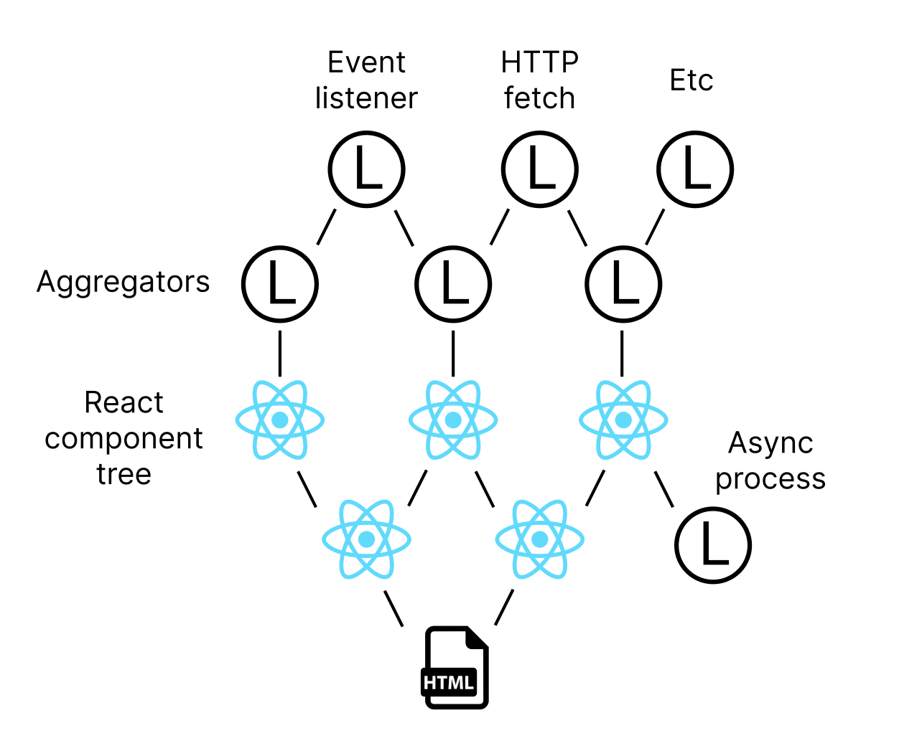

# Loader

"Loader" is a data & resource loading event pipeline, built to complement React.

<p align="center">

</p>

It provides Loaders, which are like React functions for loading data.

* They are **async** functions instead of sync.
* Like React functions, they perform automatic event subscription when called recursively, however:
* Subscriptions are indexed on a provided ID rather than the order of calls, and;
* They are deduplicated globally based on this ID, so **resources are only loaded once**.
* You can easily have hundreds or even thousands of loaders in your page.

In summary, they are designed for loading complex resources in the most efficient way, and provide fine grained control while reducing boilerplate and bugs.

In many cases, they are a more adaptable alternative to useState and friends, allowing you to model your resource loading upstream of React.

## Basics

```typescript
/*
 * This is a loader factory, ie, its a function that returns a parameterized loader.
 */
function uriLoader(uri: string) {

  return new Loader({

    /*
     * Loaders automatically deduplicate based on ID (parameters),
     * so resources wont get loaded many times. It's your responsibility
     * to create this key.
     */
    id: `uri-${uri}`,

    /*
     * The run function loads resources and may call other loaders.
     */
    async run(use) {

      // Load your resource uri
      const a = await fetch(uri)

      // Call another loader; may return a cached value
      const b = await use(someOtherLoader)

      return { a, b }
    }
  })
}
```

## `use`: a swiss army knife for subscription

## `use.zustand`: listen to a zustand store

Loader has built in support for [Zustand](https://github.com/pmndrs/zustand) (tips fedora), so subscribing to a store is easy:

```typescript
let value = use.zustand(myStore)
```

## `use.eventListener`: subscribe using `addEventListener`

```typescript
const windowSizeLoader = new Loader({                                           
  id: 'windowSize',                                                          
  async run(use) {
    /*
     * We can easily write a loader that returns the window size and triggers when it changes
     *
     * This call does not wait for the event to trigger, it will return undefined
     * if it has never been triggered. However, it will trigger this loader when the event
     * is triggered.
     *
     * The first argument is a (local) ID for the subscription.
     */
    let _ = use.eventListener('windowSize', window, 'resize')

    return {
      w: window.innerWidth,
      h: window.innerHeight
    }
  }                                                                                 
})                                                                                  
```

## Using in React

```typescript
// React component
function MyComponent() {

  let data = useLoader(uriLoader("/api/someResource"))

  // Etc
}
```
